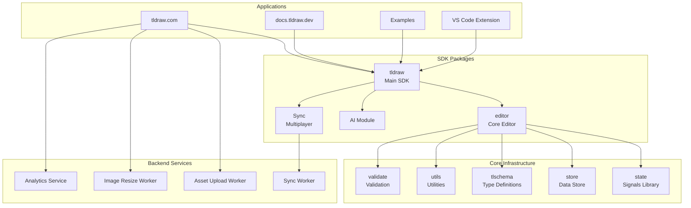
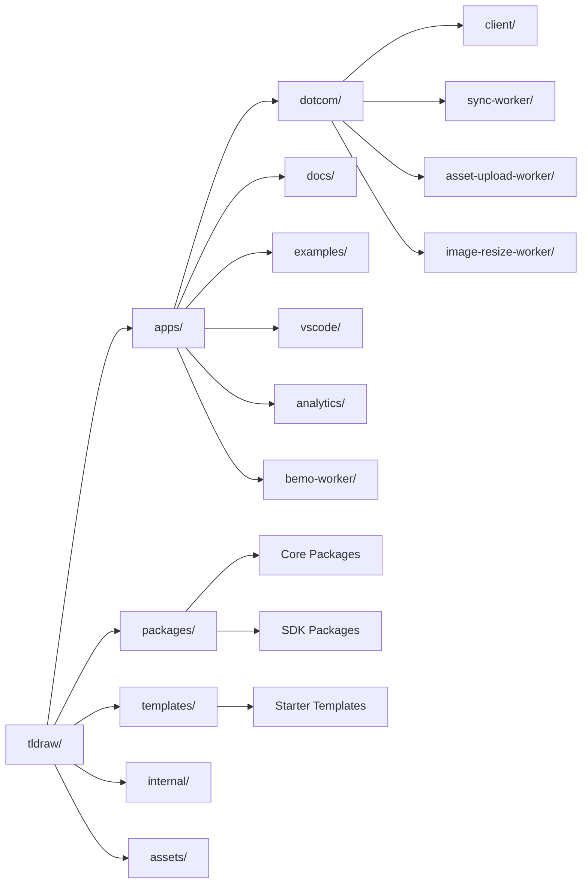
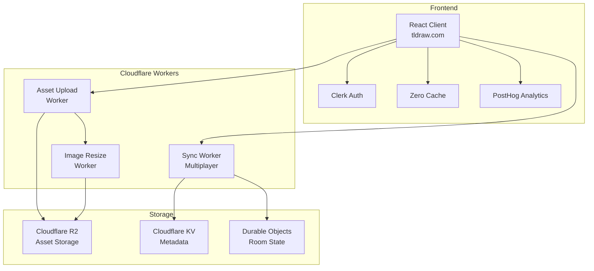
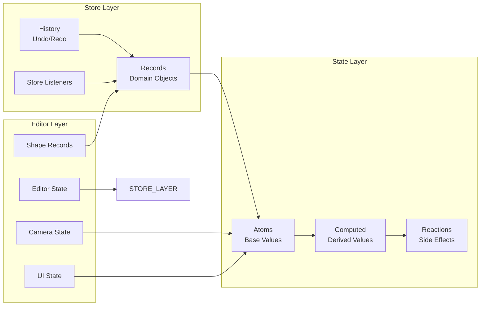
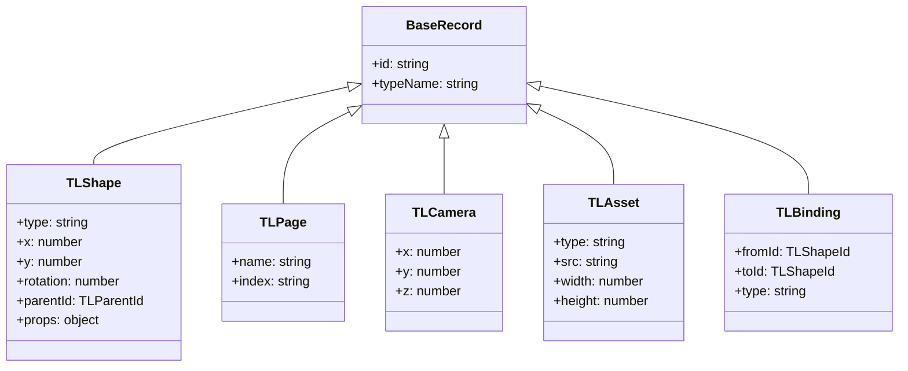
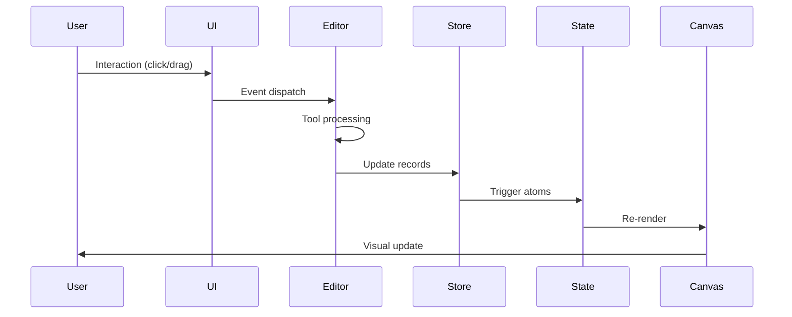
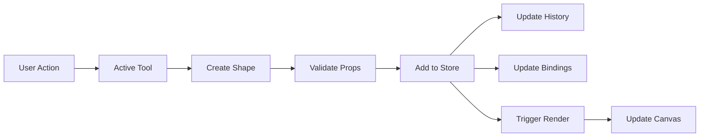
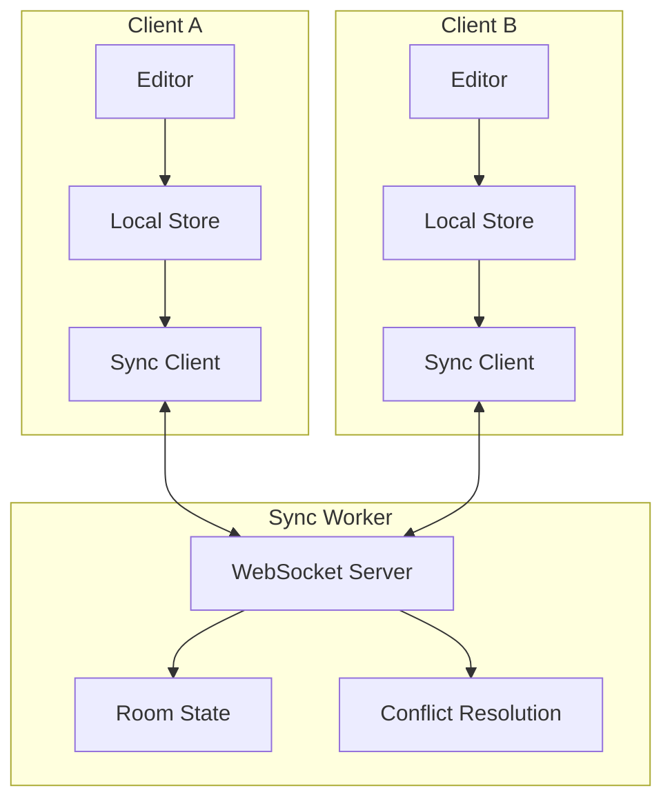
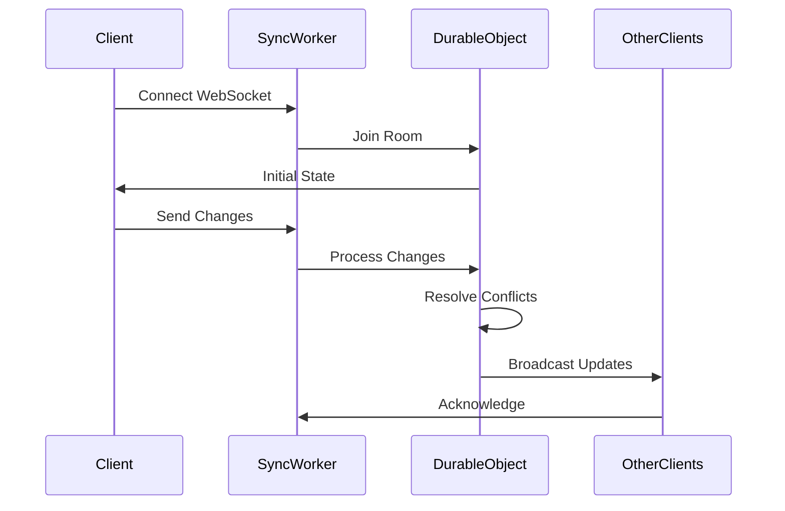
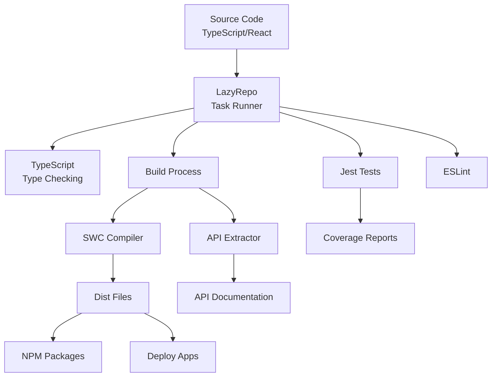

# tldraw Architecture Overview

## Table of Contents
1. [Introduction](#introduction)
2. [High-Level Architecture](#high-level-architecture)
3. [Monorepo Structure](#monorepo-structure)
4. [Core Packages](#core-packages)
5. [Application Layer](#application-layer)
6. [State Management](#state-management)
7. [Data Flow](#data-flow)
8. [Multiplayer Sync Architecture](#multiplayer-sync-architecture)
9. [Build and Development](#build-and-development)

## Introduction

tldraw is an infinite canvas whiteboard SDK built with React and TypeScript. The project is organized as a monorepo using Yarn Berry workspaces, providing both a complete whiteboard application (tldraw.com) and a flexible SDK for building custom infinite canvas experiences.

## High-Level Architecture



## Monorepo Structure

The tldraw monorepo is organized into several key directories:



### Workspace Organization

- **`apps/`**: Production applications and services
  - `dotcom/`: The tldraw.com application (client and workers)
  - `docs/`: Documentation site (tldraw.dev)
  - `examples/`: Example implementations
  - `vscode/`: VS Code extension
  - `analytics/`: Internal analytics service
  - `bemo-worker/`: Demo sync server

- **`packages/`**: Core SDK packages
  - `tldraw/`: Main SDK with shapes, tools, and UI
  - `editor/`: Core editor functionality
  - `state/`: Reactive signals library
  - `store/`: Client-side database
  - `sync/` & `sync-core/`: Multiplayer functionality
  - `ai/`: AI module for LLM integration
  - `tlschema/`: Type definitions and migrations
  - `utils/`: Shared utilities
  - `validate/`: Validation library

- **`templates/`**: Starter templates for different frameworks
- **`internal/`**: Build tools and scripts
- **`assets/`**: Fonts, icons, and translations

## Core Packages

### Package Dependency Graph

```mermaid
graph TD
    TLDRAW_PKG[tldraw<br/>v3.15.0]
    EDITOR_PKG[@tldraw/editor<br/>v3.15.0]
    STATE_PKG[@tldraw/state<br/>v3.15.0<br/>MIT License]
    STATE_REACT[@tldraw/state-react<br/>v3.15.0]
    STORE_PKG[@tldraw/store<br/>v3.15.0<br/>MIT License]
    TLSCHEMA[@tldraw/tlschema<br/>v3.15.0]
    UTILS[@tldraw/utils<br/>v3.15.0]
    VALIDATE[@tldraw/validate<br/>v3.15.0]
    AI_PKG[@tldraw/ai<br/>v3.15.0]
    SYNC_PKG[@tldraw/sync<br/>v3.15.0]
    SYNC_CORE[@tldraw/sync-core<br/>v3.15.0]
    ASSETS[@tldraw/assets<br/>v3.15.0]
    
    TLDRAW_PKG --> EDITOR_PKG
    TLDRAW_PKG --> STORE_PKG
    
    EDITOR_PKG --> STATE_PKG
    EDITOR_PKG --> STATE_REACT
    EDITOR_PKG --> STORE_PKG
    EDITOR_PKG --> TLSCHEMA
    EDITOR_PKG --> UTILS
    EDITOR_PKG --> VALIDATE
    
    STORE_PKG --> STATE_PKG
    STORE_PKG --> UTILS
    
    STATE_REACT --> STATE_PKG
    
    AI_PKG --> TLDRAW_PKG
    AI_PKG --> UTILS
    
    SYNC_PKG --> STATE_PKG
    SYNC_PKG --> STATE_REACT
    SYNC_PKG --> SYNC_CORE
    SYNC_PKG --> UTILS
    SYNC_PKG --> TLDRAW_PKG
    
    style TLDRAW_PKG fill:#f9f,stroke:#333,stroke-width:4px
    style STATE_PKG fill:#9f9,stroke:#333,stroke-width:2px
    style STORE_PKG fill:#9f9,stroke:#333,stroke-width:2px
```

### Key Package Responsibilities

1. **@tldraw/state**: Reactive signals library for state management
   - Provides `Atom`, `computed`, and reactive primitives
   - Foundation for all reactive state in tldraw

2. **@tldraw/store**: Client-side database for records
   - Record-based storage system
   - History management
   - Serialization/deserialization

3. **@tldraw/editor**: Core editor functionality
   - Canvas rendering
   - Shape management
   - Tool system
   - Event handling
   - Export capabilities

4. **tldraw**: Complete SDK with UI
   - Default shapes (arrows, boxes, etc.)
   - Default tools (select, draw, erase)
   - UI components and styling
   - Built on top of @tldraw/editor

5. **@tldraw/sync**: Multiplayer capabilities
   - Real-time collaboration
   - WebSocket-based sync
   - Conflict resolution

## Application Layer

### tldraw.com Architecture



### Documentation Site (tldraw.dev)

- Next.js application
- MDX-based content
- API reference generation
- Interactive examples

## State Management

### Reactive State Architecture



### Store Record Types



## Data Flow

### Editor Data Flow



### Shape Creation Flow



## Multiplayer Sync Architecture

### Sync System Overview



### Sync Protocol



## Build and Development

### Build Pipeline



### Development Workflow

1. **Local Development**: `yarn dev` runs the examples app with hot reload
2. **Type Checking**: `yarn typecheck` validates TypeScript across the monorepo
3. **Testing**: Jest for unit tests, Playwright for E2E tests
4. **Building**: LazyRepo orchestrates parallel builds
5. **Publishing**: Automated via CI/CD pipeline

## Key Design Patterns

### 1. **Record-Based Architecture**
- All data stored as records with unique IDs
- Enables efficient sync and history management
- Type-safe with TypeScript generics

### 2. **Reactive State Management**
- Signal-based reactivity for performance
- Computed values automatically update
- Minimal re-renders through fine-grained updates

### 3. **Extensible Shape System**
- Shape utils define behavior and rendering
- Custom shapes can be added easily
- Consistent API across all shape types

### 4. **Tool State Machine**
- Tools implemented as state nodes
- Clear transitions between tool states
- Composable tool behaviors

### 5. **Plugin Architecture**
- Bindings for shape relationships
- Custom tools and shapes
- UI component overrides

## Performance Considerations

1. **Virtual Canvas**: Only visible shapes are rendered
2. **Spatial Indexing**: Efficient hit testing and selection
3. **Incremental Updates**: Minimal DOM manipulation
4. **Web Workers**: Heavy computations offloaded
5. **Asset Optimization**: Lazy loading and caching

## Security Architecture

- **License Management**: Watermark enforcement
- **Asset Security**: Signed URLs for uploads
- **Authentication**: Clerk integration for tldraw.com
- **Data Isolation**: Per-room data separation in multiplayer

## Future Architecture Considerations

1. **Plugin Marketplace**: Ecosystem for third-party extensions
2. **Advanced Collaboration**: Presence, comments, and permissions
3. **Performance Optimizations**: WebGL rendering, WASM modules
4. **Mobile Optimization**: Touch-specific interactions
5. **AI Integration**: Expanded AI capabilities beyond current module

## Conclusion

tldraw's architecture is designed for flexibility, performance, and developer experience. The modular package structure allows developers to use only what they need, while the reactive state management ensures smooth performance even with complex drawings. The multiplayer sync architecture enables real-time collaboration, and the extensible shape and tool system allows for unlimited customization possibilities.